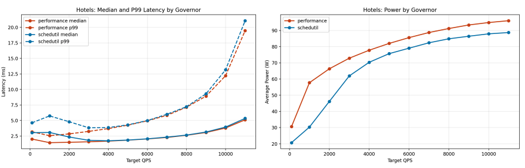

The tech industry is working hard to make datacenters - the windowless buildings powering every online purchase, post, and prompt - more energy efficient. My team felt inspired to do our part for our final course project in **CS8803: Datacenter Networks and Systems** at Georgia Tech. Because [launching a datacenter into space](https://www.npr.org/2026/04/03/nx-s1-5718416/ai-data-centers-in-space-spacex-elon-musk) or [dropping one in the ocean](https://news.microsoft.com/source/features/sustainability/project-natick-underwater-datacenter/) was out of scope for the course, we chose to focus on a more practical approach to achieving energy efficiency: clever _load balancing algorithms_ that distribute work amongst thousands of servers.

My contribution was simulating thousands of users making requests to a hotel reservation application and measuring its power consumption and latency (think: time it takes to receive a confirmation after clicking "book" on AirBnB). What I didn't know going into this project is that there are a lot of pitfalls to avoid if you want to make your results _reproducible_, meaning that anyone else can easily re-run your experiment and get the same results at any point in the future.

I believe the tips in this post are helpful not only to researchers, but anyone who is developing an application and wants to see how it will perform when thousands of users are using it. Being able to make claims like "my application takes under 5ms to load for 99% of users" of users requires convincing and reproducible results.

# How It All Started



The figure you're seeing above is what led me down a long rabbithole of trying (and failing) to recreate its findings. Simply put, the blue and orange lines in this plot represent different _frequency governors_. These governors act just like a speed limiter in a car: they intentionally limit the CPU clock rate (top speed in our analogy) to optimize for power utilization (fuel economy/safety in our analogy). The plot above shows that the blue governor uses consistently less power than the orange governor while also matching the orange governor in terms of latency (i.e. how fast users can book hotels) at high loads.

Admittedly, I didn't know enough about frequency governors at the time to flag this discovery as potentially interesting. In effect, this discovery would suggest that we can signifcantly reduce the power consumption of certain applications without negatively impacting their performance. Crucially, we don't have to sacrifice on _p99 latency_ (the dashed lines in the left plot), which is a metric datacenter operators tend to care about most. Given the recent concerns about datacenter's rising power consumption, it is no surprise our professor singled out this plot in our report and encouraged us to dig deeper.

# Tips for Reproducible Systems Research

The tips I've compiled in this guide are based on my experience profiling a gRPC-based hotel reservation service, part of the larger [DeathStarBench](https://github.com/kworathur/DeathStarBench/tree/) open-source cloud microservice benchmarking suite. In short, if you want to make sure your results are easil

In particular, I want to measure the p99 latency when the server is at the point of saturation, which you can imagine would become important if a bunch of people were searching for hotels at once.

## 1. Establish Baselines

Establishing baselines is important when measuring the performance of an algorithm because they help us quantify how well an algorithm performs. Baselines matter for reproducibility because they give us a "checkpoint" that we can always rely on to sanity check our results while conducting experiments. In general, a baseline can be a simplified version of the algorithm you are experimenting with, or an algorithm that is widely adopted and has multiple open source implementations. Since I'm comparing algorithms that limit a CPU's clock rate, a natural baseline would be an algorithm that that lets the CPU use its maximum clock rate without any imposed limits.

Before I can obtain measurements for my baseline, there is one small problem: the existing hotel reservation application is deployed using Docker, which makes deployment of the application straightforward but also makes it difficult to collect accurate measurements. Since I am measuring latency of requests, my measurements could be inflated by the latency of host networking in Docker. Further, I want to issue enough requests so that the server reaches _saturation_ (where all of its CPU resources are fully utilized), and using Docker could limit how much I can push the server.

Show docker vs. bare processes and justify why you opted for bare processes

Show docker latency vs bare process latency

```txt
Test Results @ http://10.10.3.2:5000
  Thread Stats   Avg      Stdev     99%   +/- Stdev
    Latency   124.86ms  146.21ms 580.09ms   83.60%
    Req/Sec    49.16     10.66    73.00     71.79%
  Latency Distribution (HdrHistogram - Recorded Latency)
 50.000%   78.97ms
 75.000%  211.71ms
 90.000%  328.19ms
 99.000%  580.09ms
 99.900%  775.17ms
 99.990%  844.80ms
 99.999%  844.80ms
100.000%  844.80ms
```

(maybe make this a bar chart)

These results give us a good "upper limit" on the latency figures we should get. Anything larger than these numbers, and we can be sure that something might be wrong with our experimental setup.

[TODO: add wrk2 output for bare processes]
(double check this figure)

## 2. Start out by Measuring a Single Code Branch

This tip is a little more subtle, but I'll try my best to explain it here.

This one is more subtle, but many apps today rely on caching. Caching can improve request latency, and also may make workloads more CPU intensive, the more the cache gets populated.

## 3. Change One Variable at a Time; Document Configs

## 4. Version Control is Your Friend

While you're following these tips, it may become challenging to commit frequently.
If you take away one tip from this guide, it's to commit changes frequently. This is good software engineering practice, and is what helped me find out the root cause (see below)

## Conclusion

At the end of the day, the likely root cause is out-of-sync binaries used for testing. There was a commit that changed the search functionality to do a full scan of memcached rather than filter on in and out data. While seeming insignifcant, through a lot of trial and error I see that this change decreased power usage by 4W, which is supported by the fact that the CPU is doing more work.

# The Testbench

I ran all of my profiling experiments on cloudlab c220g1 machines, which have 2 Intel Xeon E5-2630 CPUs, @ 2.40 GHz each with eight cores. 32 threads can be executing simultaneously on this machine

# Establishing a baseline

First, we want to establish baseline latencies using docker. To do this, I cloned the [DeathStarBench project](https://github.com/kworathur/DeathStarBench/tree/master) from github and followed the setup instructions.

Let's see what happens if we hit the search service with a heavy load.

# Baby Steps

Any time you want to see how a system does under load, it is good to start small.

1. try issuing a very low number of requests to the service
2. try limiting the types of requests you send to a single request. I chose to target the hotels functionality specifically because it has a larger fan-out and touches the database and cache on almost every request.

While docker is a great tool for reproducing results, it adds overhead to the request latency due to its host networking that can make it difficult to push the server to its limits. Profiling an application that's been containerized also brings its own set of challenges.

The client is the bottleneck

```txt


```
