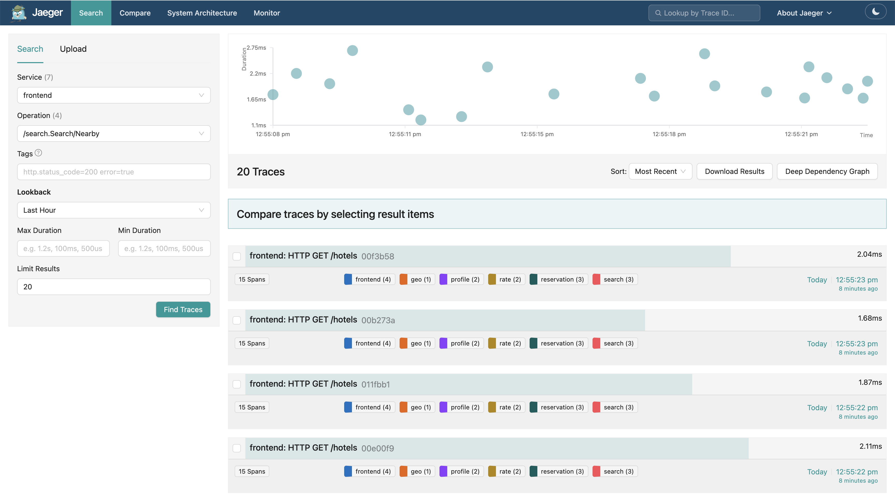
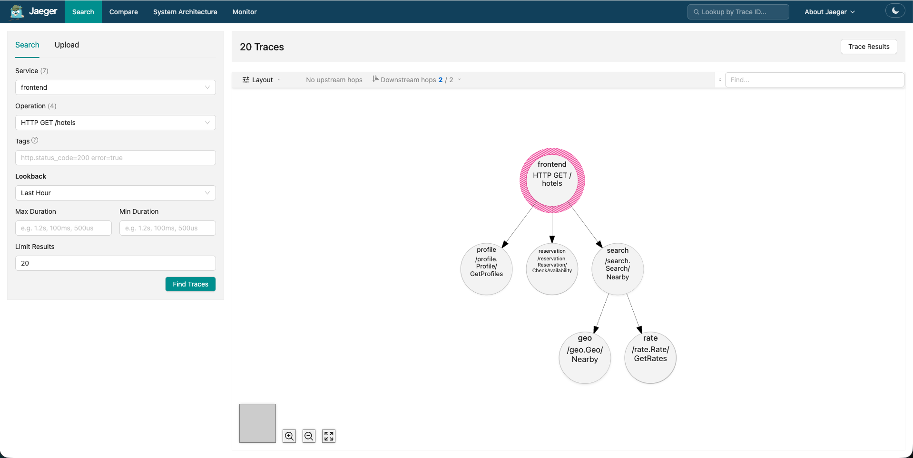
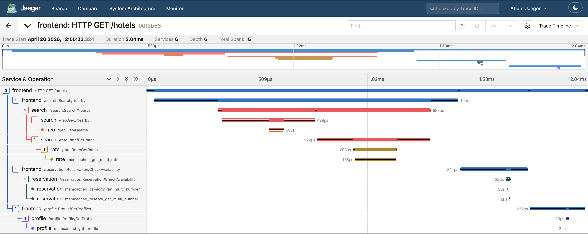

The tech industry is working hard to make datacenters - the windowless buildings powering every online purchase, post, and prompt - more energy efficient. My team felt inspired to do our part for our final course project in **CS8803: Datacenter Networks and Systems** at Georgia Tech. Because [launching a datacenter into space](https://www.npr.org/2026/04/03/nx-s1-5718416/ai-data-centers-in-space-spacex-elon-musk) or [submerging one in the ocean](https://news.microsoft.com/source/features/sustainability/project-natick-underwater-datacenter/) was out of scope for the course, we chose to focus on a more practical approach to achieving energy efficiency: clever _load balancing algorithms_ that distribute work amongst thousands of servers.

My contribution was simulating thousands of users making requests to a hotel reservation application and measuring its power consumption and latency (think: time it takes to receive a confirmation after clicking "book" on AirBnB). What I didn't know going into this project is that there are a few pitfalls to avoid to ensure your are results _reproducible_, meaning that anyone can easily re-run your experiment and get the same results in the future.

I believe the tips in this post are helpful not only to researchers, but anyone who is developing an application and wants to see how it will perform when thousands of users are using it. Even in industry settings, reproducible results are a pre-requisite for making strong claims like "my application takes under 5 milliseconds to load for 99% of users" (also called _service-level objectives (SLOs)_).

# How It All Started


The figure you're seeing above is what led me down a long rabbithole of trying (and failing) to recreate its findings. Simply put, the blue and orange lines in this plot represent different algorithms called _frequency governors_. These frequency governors act just like a speed limiter in a car: they intentionally limit the CPU clock rate (or top speed) to optimize for power utilization (or fuel economy/safety). The plot above shows that the blue governor uses consistently less power than the orange governor while matching the orange governor in terms of latency (i.e. how fast users can book hotels) at high loads.

Admittedly, I didn't know enough about frequency governors at the time to flag this discovery as potentially interesting. The real-world implication of these results is that we can gain **real power savings** for certain workloads by running frequency-limited servers close to their maximum load. Crucially, we don't have to sacrifice on precious _p99 latency_ (the dashed lines in the left plot), which is a metric datacenter operators tend to care about most. Given that data center power demand is expected grow rapidly over the next decade, it's no surprise that our professor encouraged us to reproduce our results in a real-world setting.

# Tips for Reproducible Systems Research

The tips I've compiled in this guide are based on my experience running experiments against a gRPC-based hotel reservation service, part of the larger DeathStarBench cloud microservices benchmark. Feel free to fork this [repo](https://github.com/kworathur/DeathStarBench/tree/) if you'd like to follow along in the code.

I am trying to measure the median and p99 latency of the hotel reservation application while increasing the number of requests per second (RPS). The experiment finishes once the server has reached a point of _saturation_, which is the point at which all of its CPU resources are fully utilized.

## 1. Establish Baselines

Baselines matter for reproducibility because they help us sanity check our results as we add more moving pieces to our experiments. Baselines should be obtained from the same setup we plan to run experiments against, because every machine in a datacenter may not be configured the same way (which makes the datacenter environment _heterogeneous_). For example, machines may use CPUs from different vendors (AMD or Intel), have a different number of cores, or different bandwidth on their network interface cards (NICs). For my experiments, I am using two identical machines with the specs below (more on why this is important soon):


In general, a baseline can be a simplified version of the algorithm you are experimenting with, or an algorithm that has a well-maintained open source implementation. Since I'm comparing algorithms that limit a CPU's clock rate, a natural baseline is an algorithm that that lets the CPU use its maximum clock rate without any imposed limits. To obtain my baseline measurements, I cloned the DeathStarBench repo and followed the instructions in the README.md for deploying the app inside docker containers.

After deploying the app, I had access to an HTTP server that I could send requests to, which would then make remote procedure calls to relevant microservices and return the result to the client. I am using the `wrk2` HTTP load testing tool ([docs](https://github.com/giltene/wrk2)) send requests to the HTTP server. This tool allows us to programmatically send thousands of requests per second, simulating production traffic. This is where the specs of the machines you use for testing can make a difference in obtaining accurate results: if the client has much fewer compute resources than the server (e.g. fewer threads), then it might not have the capacity to push the server to its true limits. In this case, we say that the client is the bottleneck.

To start, I simulated 128 users collectively making 1,000 requests/second using `wrk2`. After the script completed I got back some useful latency measurements:

```
Test Results @ http://10.10.1.2:5000
  Thread Stats   Avg      Stdev     99%   +/- Stdev
    Latency     7.08ms    5.47ms  21.73ms   79.14%
    Req/Sec   254.77     95.55   500.00     67.37%
  Latency Distribution (HdrHistogram - Recorded Latency)
 50.000%    6.79ms
 75.000%   10.83ms
 90.000%   14.59ms
 99.000%   21.73ms
 99.900%   29.41ms
 99.990%   38.40ms
 99.999%   42.08ms
100.000%   42.91ms
```

There's our p99 latency in the fifth row from the bottom! It looks like 99% percent of requests completed in under ~22 milliseconds. These results are already super helpful because they give us a soft "upper limit" on the latency figures we should get. Anything much larger than these numbers, and we can be sure that something might be wrong with our experimental setup.

## 2. Start out by Measuring a Single Path in Code

With our baseline established, we can start collecting measurements for the _real experiments_. There is just one catch - our hotel reservation application executes multiple paths in code before returning a result. This can make debugging abnormal latency results fairly challenging, and it's why I recommend fully experimenting with one code path first before expanding experiments to the rest of the application.

To illustrate my point more clearly, we can use an observability platform called [Jaeger](https://www.jaegertracing.io/) to visualize the code paths that are exercised for a search request. Jaeger allows us to trace the path a request takes through code in a way that print statements can't; using Jaeger, we can trace applications where a request may be passed through multiple containers (as is the case here) or multiple virtual machines scattered across a datacenter.

Opening up the Jaeger console in my browser, I am shown a summary of recent requests to the hotel reservation application:



From this trace, we can see that search requests complete within 2 milliseconds on average. In addition, we observe that each search request touches multiple microservices (geo, profile, rate, reservation, and search denoted by the small colored boxes).

Next let's click on one of the requests to get a better understanding of how a request passes through the code.



Using the data collected in traces, Jaeger is able to construct a _dependency graph_, where an arrow from one circle to another represents a remote procedure call (RPC) in the code. From this graph, we get a sense that searching for a hotel is not as straightforward as previously thought: when a user wishes to search for a hotel, our application actually has to call three seperate microservices to determine hotels that are (1) nearby (2) within the user's price range and (3) available to book during the user's vacation. What you also don't see here is that each of the leaf microservices is typically fetching data from a database (e.g. MongoDB) or a cache (e.g. Memcache). That's already a lot of moving pieces for a relatively straightforward search query.

Lastly, Jaeger gives us a timeline view of requests, that can help us understand how much time is spent querying the caches and databases.



At this point, I could start to get a sense of what produced the elusive result in the beginning of the blog post.

If I were to try running experiments again, here's what I would have done differently. I would comment out parts of the code so that I only see a chain of calls in my dependency graph, rather than the tree you see above. This is how you can make a similar change in the go server code. Furthermore, I would try to take the cache out of the picture entirely, or at least make sure that the cache is being cleared after every trial to facilitate a fair comparison between the performance governors.

## 3. Document Your Configs

When your config lives in one-liner commands that gets buried in long slack threads, it makes you more prone to overlooking a misconfigured parameter and wasting a lot of time debugging results that don't make sense. For this reason, I recommend saving all of your config in a single file. Because I was using python for my testing scripts, it made sense to create a separate config.py file with _all_ of my experimental config in it:

```


```

## 4. Version Control is Your Friend

If you take away one tip from this guide, it's to commit changes to version control frequently. This is good software engineering practice, and the value of having a git log with detailed commit messages when debugging is massively underrated.

## Conclusion

At the end of the day, the likely root cause is out-of-sync binaries used for testing. There was a commit that changed the search functionality to do a full scan of memcached rather than filter on in and out data. While seeming insignifcant, through a lot of trial and error I see that this change decreased power usage by 4W, which is supported by the fact that the CPU is doing more work.

# Baby Steps

Any time you want to see how a system does under load, it is good to start small.

1. try issuing a very low number of requests to the service
2. try limiting the types of requests you send to a single request. I chose to target the hotels functionality specifically because it has a larger fan-out and touches the database and cache on almost every request.

While docker is a great tool for reproducing results, it adds overhead to the request latency due to its host networking that can make it difficult to push the server to its limits. Profiling an application that's been containerized also brings its own set of challenges.

The client is the bottleneck

```txt


```

Before I can obtain measurements for my baseline, there is one small problem: the existing hotel reservation application is deployed using Docker, which makes deployment of the application straightforward but also makes it difficult to collect accurate measurements. Since I am measuring latency of requests, my measurements could be inflated by the latency of host networking in Docker. Further, I want to issue enough requests so that the server reaches _saturation_, and using Docker might limit how much I can push the server.

To be sure, I used the `wrk2` HTTP load testing tool to measure request latency for requests sent to a containerized version of the application compared to a version that does not run in containers.
